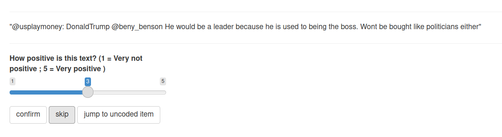

# The whole game

```{r, echo = FALSE, fig.align = "center", fig.cap = "Screenshot of the first level of Megaman X (Capcom, 1993)"}

```

## Analysing Trump's tweets

We are going to use an example to illustrate the whole process of a typical automated content analysis scenario. This is called the "Play the Whole Game" approach by @perkins2010. ^[Well, to the author of this book, this chapter is like the first level of the SNES hame 'Megaman X'. This level demonstrates the mechanic of the game. ] In this example, we start with a simple research question or hypothesis. Let's say I want to reproduce a very [famous analysis of Donald Trump's tweets](http://varianceexplained.org/r/trump-tweets/). This example is very well-known in the data science world, probably because David Robinsom (one of the authors of the tidytext package) used this example to demonstrate the power of his package (and made him on the [television](https://www.youtube.com/watch?v=vD11aSCpF4s&feature=share)). In David Robinson's TV-worthy conclusion, he found that tweets from an Android phone (probably from Trump himshelf) are more negative than tweets from an iPhone (probably from his campaign). We can refomulate this into a research question: are tweets from Donald Trump's twitter account tweeted using an iPhone more positive than those tweeted using an Android phone?

There are many elements to unpack from the above paragraph, but the above paragraph illustrates how data scientists and automated content analysis practitioners approach the problem differently. The utmost important element is: All automated content analysis project must have hypotheses to test or research questions to answer. If a project without hypotheses or research questions, it can hardly be called automated content analysis (see Chapter 2 for longer discussion). We also need to specify the context we are interested in analyzing (Donald Trump and his Twitter). Later on, we need to think about the operationalization of variables (*what is positive?*), data collection plan and data analysis strategy.

In this book, however, we are not going to focus on:

1. how to form hypotheses or research questions
2. how to collect your (text) data. 

The reason for excluding the former is simple: It needs to be supported by communication theories. As a book that is intented as an research methods book, it is probably a bit too much to ask. ^[The author of this book admits that he is not an expert in communication theories.] For the latter, the exclusion of it is due to the fact that there are good papers and textbooks available. The book chapter by @liang2017 is probably a good start. @munzert2014 's *Automated Data Collection with R* is an in-depth manual.

At this point, you should probably go to preregister the hypotheses of this automated content analysis project. And then you should study rtweet and academictwitteR. However, even you know how to use these packages and have access to the Twitter API, the data is not accessible anymore. Following the 2021 Capitol attack, his account has been permanently suspended.

Let's suppose the data is now [magically available](https://www.thetrumparchive.com/). In the companion website of this book, you can find the data file with tweets from Donald Trump's tweet account before he assumes duty as the president of the United States (2015-Jan to 2016-Dec). We need to select this time range because Donald Trump's account did not tweet anymore using an Android phone after March, 2017.

The data looks like this:

```{r loadingpkg, message = FALSE}
require(tidyverse)
require(quanteda)
require(rio)
require(lubridate)
```

```{r}
trump_tweets <- import('./data/trump.json') %>% as_tibble %>% mutate(created_at = parse_date_time(created_at, orders = '%a %b %d %H:%M:%S %z %Y')) %>% filter(created_at >= ymd_hms('2015-01-01 00:00:00') & created_at <= ymd_hms('2016-12-31 23:59:59')) 
trump_tweets
```

Up to this point, you might notice this book uses tidyverse---or more precisely, dplyr---for data manipulation. Yes. If you are not familar with dplyr, it is a good idea for you to read the book R4DS (available online). The book you are reading now is not an introduction to dplyr. But as a refresher, let me show you all the dplyr you will need to deal with 80% of the situations. You probably only need to know 5 *verbs* and then combine them together. You may call these 6 verbs "Big Six" if you like.

## An express summary of tidyverse

The first verb is __select__. It is used to select particular column(s) from a data frame. By the way, our data is a __tibble__, an arguably nicer version of data frame. Suppose we want to select only the columns source and text.

```{r}
trump_tweets %>% select(source, text)
```

The second verb is __filter__. It is used to filter rows from a tibble based on certain criteria. Suppose you want to get all the rows which were tweeted from an Android phone.

```{r}
trump_tweets %>% filter(str_detect(source, "Android")) %>% select(source, text)
```

In the above example, we combine two verbs (*filter* and *select*) using the pipe (%>%) operator. Some might disagree, but this method is more elegant. If you can tell a story using your dplyr code, it is probably a good code. For example, you can tell a story using the above code as such: We have our *trump_tweets* data, __and then__ we *filter* all tweets where *source* contains "Android", __and then__ we *select* only the *source* and *text* columns. 

So, the pipe operators in the above code are corresponding to all "and then" in the story.

From the above story, you might notice that the *source* column is recording from which device the tweet was tweeted, e.g. Android.

It is a good idea to see what are the other variants of "source" in our data. The next verb that we need to know is __group_by__. 

```{r}
trump_tweets %>% group_by(source)
```

It seems that we have done nothing here. But you might notice the output says "Groups: source [16]". *group_by* works the best when it is combined with __summarise__. dplyr is smart enough to accept both British and American spellings. So you can use *summarize* if you want. ^[This code should be replaced with __count()__, but for the sake of education, let's bear with me with a combination of *group_by* and *summarise*] We use *summarise* to generate one-element summary of your data. For example, you want to get the total number of rows of this data.

```{r}
trump_tweets %>% summarise(ntweets = n())
```

Using the above code, we can tell a story as such: We have our *trump_tweets* data, and then we want to summarise our data as *ntweets* whereas ntweets equals to n(), i.e. number of rows. Let's try to use this verb with *group_by*:

```{r}
trump_tweets %>% group_by(source) %>% summarise(ntweets = n())
```

The story of the above code is: We have our *trump_tweets* ... probably I can skip this part now, and then we group our data by *source* and then we summarise our data as *ntweets* whereas ntweets equals to n(), i.e. number of rows. So, what *group_by* does, is to split the data into groups by a certain column (or columns). The subsequent steps are then became group-based analysis. This principle is called "Split-Apply-Combine strategy" by @wickham2011.

this group-based analysis shows that there are many variants! In this analysis, we keep only those tweets from iPhone and Android only. So, which verb we should use? I give you 10 seconds to think.

Well...

```{r}
trump_tweets %>% filter(str_detect(source, "Android|iPhone"))
```

**mutate** is for creating new columns.

```{r}
trump_tweets %>% filter(str_detect(source, "Android|iPhone")) %>% mutate(android = str_detect(source, "Android")) %>% select(android, text)
```

Last but not least, **arrange** is for sorting.

```{r}
trump_tweets %>% filter(str_detect(source, "Android|iPhone")) %>% mutate(android = str_detect(source, "Android")) %>% select(android, text) %>% arrange(android)
```

It seems that it did nothing. We can set it to arrange by descending order. So that the tweets from Android are on top.

```{r}
trump_tweets %>% filter(str_detect(source, "Android|iPhone")) %>% mutate(android = str_detect(source, "Android")) %>% select(android, text) %>% arrange(desc(android))
```

Oh, yea! We have our data! So we should do our sentiment analysis now, right?

**NO!** Nein! Non! いいえ! 唔係!

## Creating ground truth data

This is another split-path between data scientists and automated content analysts. 

If you know nothing about automated content analysis, the traditional way of dealing with our data is to manually **code** all tweets. The word "code" as a verb can create confusion here, because it can also mean "programming" ^[Probably social scientists used the word "code" as a verb earlier than programmers. This is a problem of English. German has two different verbs: *kodieren* and *coden*.]. In this programming-heavy book, I am going to use another verb for "code" (in the social sciences' sense): annotate. I believe this term can still capture most, but not all, nuances of the verb "code" (in the social sciences' sense). For "coding" in programmers' sense, I am going to use "programming".

Sorry for the detour. Traditionally, social scientists approach this problem by annotating the unstructured data into a form suitable for computer analysis. A tweet is a bunch of characters that a (naive) computer cannot extract meanings---or semantics---out of it. However, whether or not a tweet is positive is a semantic problem. *Homo sapiens* have a brain and some of us have the knowledge in English to determine the semantics of a piece of English text. We need to tell the computer, what semantically is expressed in a tweet. This procedure is called annotation.

In an academic setting, it usually means the principal investigator of this project (i.e. you) would assemble a team of student assistants to annotate all tweets by reading them one by one and then asserting every one of them if they are positive or not. In order to ensure interrater reliability, we usually assign at least two student assistants to annotate the same set of tweets.

This procedure of annotation is notoriously expensive. In Germany, for instance, one needs to pay a student assistant €15.8 per hour in 2020. Let's assume a student assistant can annotate 4 tweets per minute. In order to read every single tweets (n = 15,267) by two students, it takes (15,267 x 2) / 4 = 7,633.5 man-minutes or 127.2 man-hours. Therefore, the principal investigator (i.e you) needs to pay €2009.76 just for the annotation. It is not a handsome amount of money: You can buy 4464 packs of instant ramen that you can eat for about a year. But remember, now you are not doing this for your PhD thesis. It is just an exercise of a stupid book. If you are willing to pay this, great for you. If you are not willing to pay this, what should you do?

Instead of asking your student assistants to annotate all data, we can use a computer to do that. But as I said previously, a (naive) computer cannot extract semantics from a piece of text. However, it can extract an approximated version of semantics ---or a **surrogate measure**--- from text content. So, what is a surrogate? The dictionary by @upton2014 gives this definition: "A variable that can be measured (or is easy to measure) that is used in place of one that cannot be measured (or is difficult to measure)". A very similar term is "proxy measure" but there is one crucial difference: Proxy measure is a variable that is used in place of one that cannot be measure. Period. There is no "or" after it. As indicated previously, we **can** measure the negativity or a tweet by manual data categorization, it is just "diffuclt to measure" due to the cost. Thus, we use a surrogate measure instead.

A good surrogate measure should have a strong correlation with the original variable. For example, it is difficult to assess the wealth of a family. It is just difficult, not impossible. As a surrogate measure, we can use the value of the family's house as an approximation. We know that in normal circumstances, the two variables (the wealth of the family and the value of the family's house) should be correlated. But for this correlation to be valid, there are many assumptions: people can actually afford a house, rich people buy expensive houses and the housing market is not regulated, just to name three. A surrogate measure is good only when the **domain** of the measurement can hold the assumptions that maintain the correlation between the surrogate measure and the actual measure. We will come back to this point in Chapter 4.

We ---as a practitioner of automated content analysis--- cannot blindly accept a surrogate measure is always good. It is related to the fact that we are doing automated content analysis and automated content analysis is actually still a content analysis. In the next chapter, we will come back to the validity requirement of **any** content analysis, automated or not.

Up to this point, we have a dilemma: Manual annotation is too expensive but automated content analysis is just a surrogate measure. What should we do?

A simple solution is to test whether the domain of our measurement fits the original assumptions. Therefore, we need to test the correlation between the approximated semantics extracted by the computer and the semantics extracted by humans. As said before, a good surrogate measure should have a strong correlation with the original measurement. For this, we do not need to manually categorize a lot of tweets. A represenative subset of tweets will do. We have a name for these manually annotated data for testing the validity of a tool: **ground truth data**. 

We will talk more on how to create ground truth data in Chapter 4. As an excercise of creating ground truth data, let's say we want to create a set of ground truth data with a random sample of 30 tweets. It can be done easily with:

```{r}
set.seed(42)
trump_tweets %>% sample_n(30) %>% select(text) %>% rio::export('data/trump_tweet30.rds')
```

And then, I ask my team of two student assistants to manually categorize these 30 tweets. This task should take (30 x 2) / 4 = 15 man-minutes. The cost of it (€3.95) is only a few packs of instant ramen. Or, if you are middle class and don't mind damaging the environment, it is the cost of a "coffee to go".

The annotation procedure is simple, or even simplified. We will talk about the setup of such annotation task using the R package oolong [@chan:oolong] in Chapter 5. 

The two student assistants annotate the 30 tweets based on the level of positive sentiment with a 5-point Likert (visual analog) scale, i.e.

```{r, echo = FALSE, fig.align = "center", fig.cap = "Annotating the sentiment of a random tweet from Trump"}

```

And the data looks like this:

```{r}
trump_tweet30_coded <-  rio::import("data/trump_tweet30_coded.rds")
trump_tweet30_coded
```

We consider the two columns of `coder1` and `coder2` our ground truth data. In the next section, we will use these ground truth data to validate the automatically extracted semantics from Trump's tweets.

## Automated sentiment analysis: AFINN

Now, with the ground truth data, we can finally do the so called 'sentiment analysis'. Before, we really do it, I would like to remind you for one last time that the semantics extracted by these method are an approximated version of the true semantics. Thus, it is a surrogate at best.

The simpliest method for doing a sentiment analysis is using a dictionary-based method. These methods will be explained in Chapter 6. In short, these methods rely on three simple assumptions to calculate the overall sentiment of a piece of text. A dictionary is a collection of words. For example, a negative dictionary might have words that contain negative meanings, for example, f-words. A positive dictionary might have words such as _good_, _nice_, _wonderful_. A piece of text with a lot of words in the negative dictionary should have a higher negativity and vice versa.

There are many of these dictionaries available. These readily available dictionaries are called __off-the-shelf dictionaries__. In Chapter 6, we will discuss the problems of using them. But one way to avoid those problems is to first create ground truth data and validate these dictionaries before use. Here, we are going to use the AFINN dictionary [@nielsen2011new]. It is a dictionary designed for measuring sentiment of microblog data, e.g. tweets.

```{r}
afinn <- readRDS("data/afinn.RDS")
afinn
```

Sorry for the strong language. AFINN contains categories of words sorted by valence values from -5 (neg5) to +5 (pos5). For example, the word 'bastard' is -5 in terms of valence value.

According to original paper of AFINN [@nielsen2011new], the AFINN sentiment score of a tweet is calculated as the total valence values of matching words divided by the total number of words. For example, the AFINN sentiment score of the tweet "He is a bastard" is -5 / 4 = 1.25. The total valence values of matching words is 5 because there is only one matching word (bastard) and its valence value is -5. In total, this tweet has 4 words.

The following program calculates the correponding AFINN score of each tweet using the R package quanteda [@benoit:2018]. In short, this program creates a document-feature matrix (DFM) using Trump's tweets and then look up this DFM by the AFINN dictionary to seek for matching words. And then, we convert this DFM into a data frame and then do our dplyr magic to calculate the AFINN sentiment score. It might look a bit scary and don't worry, we will walk through this program again step-by-step in Chapter 6.

```{r}
dfm(trump_tweet30_coded$text, remove_punct = TRUE) %>% dfm_lookup(afinn) %>% quanteda::convert(to = "data.frame") %>% mutate(matching_word_valence = (neg5 * -5) + (neg4 * -4) + (neg3 * -3) + (neg2 * -2) + (neg1 * -1) + (zero * 0) + (pos1 * 1) + (pos2 * 2) + (pos3 * 3) + (pos4 * 4) + (pos5 * 5), base = ntoken(trump_tweet30_coded$text, remove_punct = TRUE), afinn_score = matching_word_valence / base) %>% pull(afinn_score) -> afinn_score
afinn_score
```

Once again, this AFINN sentiment score is a surrogate measure of semantics. We can test the correlation between the AFINN score and the results from two human coders.

```{r}
cor.test(trump_tweet30_coded$rater1, afinn_score)
```

```{r}
cor.test(trump_tweet30_coded$rater2, afinn_score)
```

The two correlation coefficients are statistically sigificant. The scatterplot of the two measures is like so:

```{r corafinn_human, fig.cap = "Scatterplot of the correlation between human categorization and AFINN score."}
trump_tweet30_coded %>% mutate(afinn_score = afinn_score) %>% mutate(avg_human = (rater1 + rater2) / 2) %>% ggplot(aes(x = avg_human, y = afinn_score)) + geom_point() + geom_smooth(method = "lm")
```

It seems that we have evidence to show the AFINN score is a good surrogate measure of sentiment because it has a good correlation with human judgements. Only after this step, we can apply the method to all of the tweets.

## Comparing tweets from Android and iPhone

So, we have shown in the previous sections that AFINN score is a good surrogate measure of sentiment. Now, we can calculate the AFINN score of all tweets.

```{r}
trump_tweets %>% filter(str_detect(source, "Android|iPhone")) %>% mutate(android = str_detect(source, "Android")) %>% select(android, text) -> trump_tweets_target
trump_tweets_target
```

Once again, we use quanteda to calculate the AFINN score. The program below is actually the same as the one above.

```{r}
dfm(trump_tweets_target$text, remove_punct = TRUE) %>% dfm_lookup(afinn) %>% quanteda::convert(to = "data.frame") %>% mutate(matching_word_valence = (neg5 * -5) + (neg4 * -4) + (neg3 * -3) + (neg2 * -2) + (neg1 * -1) + (zero * 0) + (pos1 * 1) + (pos2 * 2) + (pos3 * 3) + (pos4 * 4) + (pos5 * 5), base = ntoken(trump_tweets_target$text, remove_punct = TRUE), afinn_score = matching_word_valence / base) %>% pull(afinn_score) -> all_afinn_score
```

So now, we have the information about the device and the AFINN score.

```{r}
tibble(afinn = all_afinn_score, android = trump_tweets_target$android, trump_tweets_target$text)
```

We can see the mean AFINN scores of tweets from Android and iPhone.

```{r}
tibble(afinn = all_afinn_score, android = trump_tweets_target$android) %>% group_by(android) %>% summarise(mean_afinn = mean(afinn), se = sd(afinn) / sqrt(n()), lower = mean_afinn - (1.96 * se), upper = mean_afinn + (1.96 * se))  %>% mutate(phone = ifelse(android, "Android", "iPhone")) %>% select(-se, -android)
```

Tweets from Android are having a slightly lower sentiment score (more negative) than those from iPhone. We can also conduct a test to study the statistical significance of the difference.

```{r}
tibble(afinn = all_afinn_score, android = trump_tweets_target$android) %>% wilcox.test(afinn ~ android, data = .)
```

It is statistically significant. You can see the distributions of AFINN scores of tweets from an Android and an iPhone with the following histogram.

```{r dot}
tibble(afinn = all_afinn_score, android = trump_tweets_target$android) %>% ggplot(aes(x = afinn, fill = android)) + geom_histogram(binwidth = 0.05, alpha = 0.5)
```

In summary, Trump's tweets from an Android phone are more negative than those from an iPhone. We have arrived at a very similar conclusion to Robinson's, although the effect size is much smaller.

The obvious question you may ask is: Why could Robinson get such a large effect size? A more important question: Whom should you trust?

In Chapter 6, we will have a more detailed discussion about the pros and cons of using dictionary-based methods. Regarding the question of "whom should you trust?", our approach has face validity and criterion validity. For face validity, We have used a dictionary designed for studying social media data (AFINN), whereas David Robinson used NRC dictionaries which are not designed for studying social media data. For criterion validity, we have validated our AFINN scores with some human-categorized tweets. We have evidence that our AFINN scores correlate well with human judgements of sentiment. David Robinson had no such information.

There are some information which is important. Dictionary-based methods are very sensitive to content length. One thing you need to know is that Trump's tweets from an android are in general longer than tweets from an iPhone. Also, these tweets are in general more negative.

```{r}
tibble(afinn = all_afinn_score, android = trump_tweets_target$android, text = trump_tweets_target$text, ntokens = ntoken(text, remove_punct = TRUE)) %>% group_by(android) %>% summarise(mean_ntokens = mean(ntokens), mean_afinn = mean(afinn))
```

We can demonstrate it using a scatterplot.

```{r histo}
tibble(afinn = all_afinn_score, android = trump_tweets_target$android, text = trump_tweets_target$text, ntokens = ntoken(text, remove_punct = TRUE)) %>% ggplot(aes(y = afinn, x = ntokens, col = android)) + geom_point() + geom_smooth(method = "loess")
```

In Chapter 6, I will demonstrate further why we always need to check for the influence of content length. In our AFINN score calculation, we have adjusted for the effect of content length. However, our AFINN score is still correlated with content length with a correlation coefficient of `r round(cor(ntoken(trump_tweets_target$text, remove_punct = TRUE), all_afinn_score), 2)`.

OK, enough. This is not a diss track. Let's move on and go to the summary of this chapter, shall we?

```{r, echo = FALSE, include = FALSE}
nrc <- readRDS("data/nrc.RDS")
dfm(trump_tweets_target$text, remove_punct = TRUE) %>% dfm_lookup(nrc) %>% quanteda::convert(to = "data.frame") %>% as_tibble %>% mutate(ntokens = ntoken(trump_tweets_target$text, remove_punct = TRUE), android = trump_tweets_target$android) -> nrc_scores

nrc_scores %>% group_by(android) %>% summarise_at(vars(anger:ntokens), mean)
```

## Summary

In this chapter, I have used a "whole game" to demonstrate the differences between automated content analysis and other approaches. It can be summarized into a few bullet points:

1. Automated content analysis always starts with research questions or hypotheses.
2. Automated content analysis is a class of content analysis, therefore, we need to demonstrate the validity and reliability of our measurement.
3. Automated content analysis is usually a cost-cutting measure because manual content analysis is very expensive when _n_ is getting larger.
4. We can extract semantics from a piece of text using automated methods. But we must bear in mind that these extracted semantics are surrogate ---Not always true---. Because of the bullet point 2 above, we need to show that the surrogate measure is a good approximation of human judgement.
5. There are many (hidden) problems associated with automated extraction of semantics from a piece of text.

I hope this chapter can motivate you to dig deeper into the world of automated content analysis. In the next chapter, we are going to define (automated) content analysis and establish some best practices.
